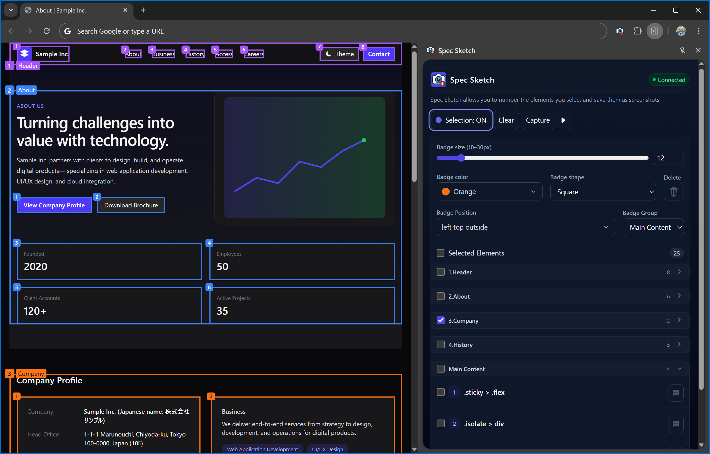
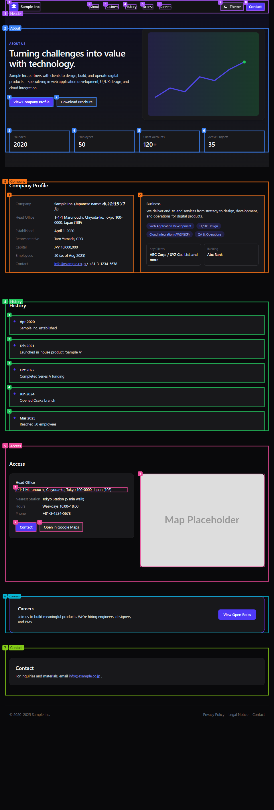

<h1 align="center"> Spec Sketch</h1>

  
  
  

  

> [!note]
> 要素を選択して連番バッジを重ね、フルページまたはビューポートのスクリーンショットに注釈として書き込めるChrome 拡張（MV3）。\
> 設計レビュー・受入テスト・不具合報告・UI仕様作成をスピーディに！

  

  
  
  

---

## 目次

- [目次](#目次)
- [主な機能](#主な機能)
- [デモ](#デモ)
- [クイックスタート](#クイックスタート)
  - [インストール（Chrome Web Store 推奨）](#インストールchrome-web-store-推奨)
- [操作ガイド](#操作ガイド)
  - [要素の選択・解除](#要素の選択解除)
  - [バッジの調整](#バッジの調整)
    - [色・形・サイズ](#色形サイズ)
    - [位置](#位置)
  - [連番・グルーピング・コメント](#連番グルーピングコメント)
  - [キャプチャ](#キャプチャ)
- [権限と保存データ](#権限と保存データ)
  - [付与している権限](#付与している権限)
  - [保存データとプライバシー](#保存データとプライバシー)
- [対応・制限事項](#対応制限事項)
- [トラブルシューティング](#トラブルシューティング)
- [ライセンス](#ライセンス)

---

## 主な機能

  

    <h4>🖱️ クリックで選択</h4>
    
ページ要素をクリックして <b>枠線＋連番バッジ</b> を重ねる。再クリックで解除。

  

  

    <h4>🗂️ サイドパネル編集</h4>
    
選択した要素を <b>並べ替え</b>、<b>グループ</b>、<b>コメント</b> を楽々編集。折りたたみ対応。

  

  

    <h4>🖼️ フル/ビューポート撮影</h4>
    
Chrome CDP で <b>フルページ</b> 撮影に対応。PNG/JPEG、倍率、品質を指定。

  

  

    <h4>💾 自動復元</h4>
    
選択状態を <code>chrome.storage.local</code> に保存。ページ再訪で自動再描画。

  

---

## デモ

<figure>
  
  
① 選択 → ② バッジ採番 → ③ コメント付与 → ④ 並び替え → ⑤ キャプチャ

</figure>

<figure>
  
フルページキャプチャに注釈が焼き込まれた出力例（PNG）

  

    
フルページキャプチャ

    
  

</figure>

---

## クイックスタート
> [!tip]
> 初めて使う方は **Chrome Web Store 版** が手軽です。開発や検証を行う方は **ローカル読み込み** を利用してください。

  

### インストール（Chrome Web Store 推奨）

1. 上の **Install on Chrome Web Store** をクリック  
2. **Chrome に追加** → **拡張機能を追加**  
3. ツールバーの拡張アイコンから **Side Panel** を開く  
4. ページで要素を選択 → **Capture（Full / Viewport）**

  
<b>ローカル読み込み（開発者向け）</b>

1. **ZIP をダウンロード**
   [**spec-sketch** ブランチ](https://github.com/Ymmy833y/SpecSketch/tree/spec-sketch)（または <kbd>spec-sketch-x.x.x</kbd> ブランチ）を開き、<kbd>Code</kbd> → <kbd>Download ZIP</kbd> で ZIP を取得します。

2. **ZIP を展開（解凍）**
   ダウンロードした ZIP を展開します。**`manifest.json` が直下にあるディレクトリ**が読み込み対象です。

3. **Load unpacked**（Chrome に読み込み） <kbd>拡張機能</kbd> → <kbd>デベロッパーモード</kbd> → <kbd>パッケージ化されていない拡張機能を読み込む</kbd> → **手順 2 で展開したフォルダ** を選択します。

4. **Open Side Panel**
   ツールバーの拡張アイコンから **Side Panel** を開きます。

---

## 操作ガイド

### 要素の選択・解除

* サイドパネルの **Select mode** を **ON** → ページ上の要素をクリック → **枠線 & 連番バッジ** を重ねて表示
* 同じ要素を **再クリック** で解除
* **ホバー**時は枠が追随、**スクロール/リサイズ**でも位置を自動調整

### バッジの調整

#### 色・形・サイズ
<table>
  <thead>
    <tr>
      <th>項目</th>
      <th>選択肢</th>
    </tr>
  </thead>
  <tbody>
    <tr>
      <td>🎨色</td>
      <td>グレー / 赤 / オレンジ / 緑 / 青 / 紫 / ピンク / 黄色 / ライム / シアン</td>
    </tr>
    <tr>
      <td>⬛形</td>
      <td>丸 / 四角</td>
    </tr>
    <tr>
      <td>🔠サイズ</td>
      <td>10px 〜 30px</td>
    </tr>
  </tbody>
</table>

#### 位置

> [!note]
> バッジは次の **16方位 + 中央** から選択できます。\
> 要素の上下左右にかからない位置を選ぶと被りを避けやすくなります。

| 配置         | オプション        |
| ------------ | ---------------- |
| Right Top    | Outside / Inside |
| Right        | Outside / Inside |
| Right Bottom | Outside / Inside |
| Top          | Outside / Inside |
| Center       | —                |
| Bottom       | Outside / Inside |
| Left Top     | Outside / Inside |
| Left         | Outside / Inside |
| Left Bottom  | Outside / Inside |

### 連番・グルーピング・コメント

* **連番は自動採番**。サイドパネルの一覧で **ドラッグ or 操作** により並べ替え
* **グループ**（A/B/C… または Ungrouped）単位で **開閉（折りたたみ）**
* **コメント**は複数行可

### キャプチャ

<table>
  <thead>
    <tr>
      <th>項目</th><th>選択肢</th><th>備考</th>
    </tr>
  </thead>
  <tbody>
    <tr><td>Format</td><td>PNG / JPEG</td><td>JPEG 時は <code>quality</code>（0–100）を指定可能</td></tr>
    <tr><td>Area</td><td>Full / Viewport</td><td>Full はページ全体。Viewport は見えている範囲</td></tr>
    <tr><td>Scale</td><td>0.5 ~ 2.0</td><td>出力解像度の倍率。2.0 で高精細、容量は増加</td></tr>
  </tbody>
</table>

---

## 権限と保存データ

### 付与している権限

* `sidePanel` — サイドパネル UI の表示/操作に使用
* `scripting` — 必要なときにコンテントスクリプトを動的注入するために使用
* `storage` — 選択アイテム等の状態をローカルに保存/復元
* `tabs` — アクティブタブ取得・接続などタブ情報の参照に使用
* `debugger` — Chrome DevTools Protocol（CDP）を用いたフルページキャプチャのために使用
* `downloads` — 生成した画像ファイルをローカルへ保存するために使用
* **host_permissions**: `"<all_urls>"` — 任意サイトで拡張を動作させるためのホスト権限（コンテント側の処理・CSS配信など）

### 保存データとプライバシー
* **保存先**: chrome.storage.local にページ単位で選択情報を保存
* **送信**: 外部サーバーへは送信しません
* **出力**: 生成画像は Downloads API でローカルに保存

> [!note]
> 🔐 プライバシーに配慮し、ユーザーデータは端末内で完結します。

---

## 対応・制限事項

* `chrome://` / `about:` 等の内蔵ページでは動作不可
* 非常に長大なページや巨大画像が多いページでは、メモリ上限で失敗する場合あります
* DOM 構造が大きく変わると過去の選択とマッチしないことがあります

---

## トラブルシューティング

  
🧩 権限エラーで撮影できない

  <ul>
    <li>サイドパネルを開き、対象タブで拡張が有効化されているか確認</li>
    <li>ユーザー操作後に <code>debugger</code> 権限が付与される場合あり（パネル操作→撮影）</li>
  </ul>

  
💾 保存済み選択が復元されない

  <ul>
    <li>ページURLやDOM構造の差異を確認</li>
    <li>ストレージをクリア→再設定で復旧するケースあり</li>
  </ul>

---

## ライセンス

[MIT License](./LICENSE)
