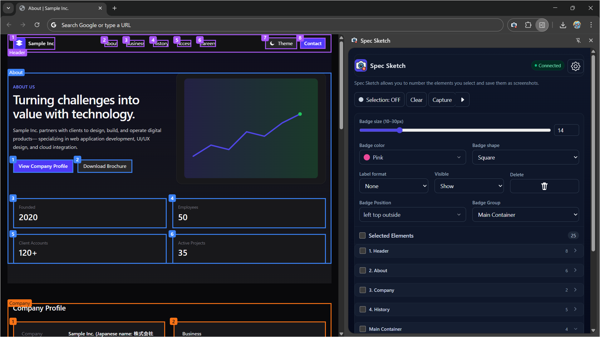

<h1 align="center"> Spec Sketch</h1>

  
  
  

  

> [!note]
> A Chrome extension (MV3) that lets you select elements, overlay numbered badges, and burn those annotations into **full-page** or **viewport** screenshots.\
> Ideal for spec reviews, UAT, bug reports, and UI documentation—fast and consistent.

  

  
  
  

---

## Table of Contents

- [Table of Contents](#table-of-contents)
- [Features](#features)
- [Demo](#demo)
- [Quick Start](#quick-start)
  - [Install (Recommended: Chrome Web Store)](#install-recommended-chrome-web-store)
- [User Guide](#user-guide)
  - [Select / Unselect Elements](#select--unselect-elements)
  - [Badge Tuning](#badge-tuning)
    - [Color / Shape / Size](#color--shape--size)
    - [Position](#position)
  - [Numbering, Grouping, Comments](#numbering-grouping-comments)
  - [Capture](#capture)
- [Permissions \& Data](#permissions--data)
  - [Granted Permissions](#granted-permissions)
  - [Stored Data \& Privacy](#stored-data--privacy)
- [Supported / Limitations](#supported--limitations)
- [Troubleshooting](#troubleshooting)
- [License](#license)

---

## Features

  

    <h4>🖱️ Click to Select</h4>
    
Click elements to overlay a <b>bounding box + numbered badge</b>. Click again to unselect.

  

  

    <h4>🗂️ Side Panel Editing</h4>
    
<b>Reorder</b>, <b>group</b>, and <b>comment</b> on selected items from the side panel (with collapsible groups).

  

  

    <h4>🖼️ Full / Viewport Capture</h4>
    
Full-page screenshots via Chrome CDP. Configure PNG/JPEG, scale, and quality.

  

  

    <h4>💾 Auto Restore</h4>
    
Persist selection state in <code>chrome.storage.local</code>; auto-restore on revisit.

  

---

## Demo

<figure>
  
  
① Select → ② Auto numbering → ③ Add comments → ④ Reorder → ⑤ Capture

</figure>

<figure>
  
Example: full-page screenshot with burned-in annotations (PNG)</@>
  

    
Full-page capture

    
  

</figure>

---

## Quick Start
> [!tip]
> If you're new to Spec Sketch, the **Chrome Web Store version** is the easiest way to get started.  
> If you're developing or validating changes, use the **Local (unpacked) install**.

  

### Install (Recommended: Chrome Web Store)

1. Click **Install on Chrome Web Store** above  
2. Click **Add to Chrome** → **Add extension**  
3. Open the **Side Panel** from the extensions icon in the toolbar  
4. Select elements on the page → run **Capture (Full / Viewport)**

  
<b>Local (Unpacked) Install — for developers</b>

1. **Download ZIP**
   Open the [**spec-sketch** branch](https://github.com/Ymmy833y/SpecSketch/tree/spec-sketch) (or a <kbd>spec-sketch-x.x.x</kbd> branch), then <kbd>Code</kbd> → <kbd>Download ZIP</kbd>.

2. **Unzip**
   Extract the ZIP. The folder to load must have **`manifest.json` at its root**.

3. **Load unpacked (Chrome)** <kbd>Extensions</kbd> → <kbd>Developer mode</kbd> → <kbd>Load unpacked</kbd> → select the **unzipped folder** from Step 2.

4. **Open Side Panel**
   Launch the **Side Panel** from the extension icon on the toolbar.

---

## User Guide

### Select / Unselect Elements

* Turn **Select mode** **ON** in the side panel → click elements to show **box & numbered badge**
* Click again to unselect
* The hover outline follows the cursor; positions auto-update on scroll/resize

### Badge Tuning

#### Color / Shape / Size

<table>
  <thead>
    <tr>
      <th>Setting</th>
      <th>Options</th>
    </tr>
  </thead>
  <tbody>
    <tr>
      <td>🎨 Color</td>
      <td>Gray / Red / Orange / Green / Blue / Purple / Pink / Yellow / Lime / Cyan</td>
    </tr>
    <tr>
      <td>⬛ Shape</td>
      <td>Circle / Square</td>
    </tr>
    <tr>
      <td>🔠 Size</td>
      <td>10px – 30px</td>
    </tr>
  </tbody>
</table>

#### Position

> [!note]
> Choose from **16 compass points + Center**.\
> Prefer positions that don’t cover important text or UI.

| Positions    | Options          |
| ------------ | ---------------- |
| Right Top    | Outside / Inside |
| Right        | Outside / Inside |
| Right Bottom | Outside / Inside |
| Top          | Outside / Inside |
| Center       | —                |
| Bottom       | Outside / Inside |
| Left Top     | Outside / Inside |
| Left         | Outside / Inside |
| Left Bottom  | Outside / Inside |

### Numbering, Grouping, Comments

* **Auto numbering** for new items; **reorder** items from the side panel (drag or panel controls depending on your setup)
* **Groups** (A/B/C… or Ungrouped) support **collapse/expand**
* **Comments** support multiple lines

### Capture

<table>
  <thead>
    <tr>
      <th>Setting</th><th>Options</th><th>Notes</th>
    </tr>
  </thead>
  <tbody>
    <tr><td>Format</td><td>PNG / JPEG</td><td>For JPEG, set <code>quality</code> (0–100)</td></tr>
    <tr><td>Area</td><td>Full / Viewport</td><td>Full = entire page; Viewport = current view</td></tr>
    <tr><td>Scale</td><td>0.5 ~ 2.0</td><td>Higher scale = sharper image, larger file size</td></tr>
  </tbody>
</table>

---

## Permissions & Data

### Granted Permissions

* `sidePanel` — side panel UI
* `scripting` — dynamic content script injection when needed
* `storage` — persist and restore selection state locally
* `tabs` — read active tab/connect, etc.
* `debugger` — Chrome DevTools Protocol (CDP) for full-page capture
* `downloads` — save generated images to the local machine
* **host_permissions**: `"<all_urls>"` — allow the extension to operate on any site (including loading overlay CSS)

### Stored Data & Privacy

* **Storage**: page-scoped selection data in `chrome.storage.local`
* **Network**: no data is sent to external servers
* **Output**: generated images are saved locally via the Downloads API

> [!note]
> 🔐 All data stays on your device. No external transmission.

---

## Supported / Limitations

* Not available on internal pages like `chrome://` or `about:`
* Very long pages or pages with many large images may hit memory limits
* If the DOM changes substantially, previously saved selections may no longer match

---

## Troubleshooting

  
🧩 Unable to capture due to permission errors

  <ul>
    <li>Reopen the side panel and check the extension is enabled for the target tab</li>
    <li>After a user interaction, Chrome may prompt for <code>debugger</code> permission (panel → capture)</li>
  </ul>

  
💾 Saved selections aren’t restored

  <ul>
    <li>Check for URL or DOM differences</li>
    <li>Clear storage and re-create selections if necessary</li>
  </ul>

---

## License
[MIT License](./LICENSE)
